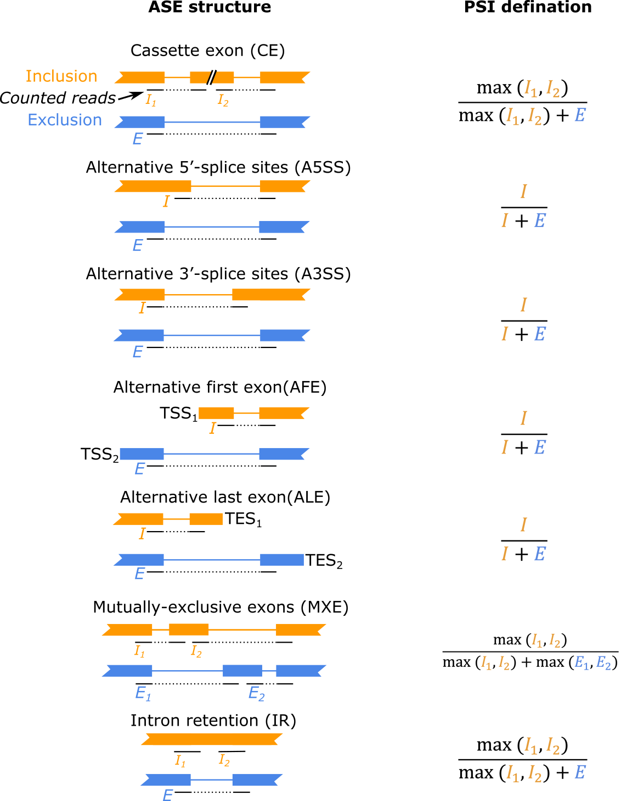

# scAPA
**s**ingle-**c**ell **A**lternative s**P**licing **A**nalyzer (scAPA) is a bioinformatic program to detect and quantify alternative splicing events (ASEs) from 10x Genome single-cell RNAseq data. scAPA detects reads spanning exon-exon junctions within a gene, while discovering all types of ASEs without totally rely on transcript annotation, quantifying ASEs on cell level based on barcodes,  adopting the uneven read coverages, and incorporating unique molecular identifier (UMI) information to handle single-cell data (Figure 1d; see Methods). scAPA only considers ASEs supported by at least 10 junction reads, allowing both a reference and alternative AS isoform to be defined.

## System requirements
scAPA was designed to run under command line of Linux server with memery no less than 32G.

## Installation
Running scAPA relys on Julia language compilor on Linux OS. First of all, user needs to install Julia (v1.7+). A bininary version of Julia program can be downloaded from the [official website](https://julialang.org/downloads/).

scAPA can be installed by running below code in bash:
```bash
$ julia -e 'using Pkg; Pkg.add(PackageSpec(url="git://github.com/Jieyi-DiLaKULeuven/scAPA.git"))'
```
Or install under julia package environment (press key `]` in Julia REPL):
```julia
(v1.9) pkg> add git@github.com:Jieyi-DiLaKULeuven/scAPA.git
```
The dependent packages and the external tool `StringTie` will be installed automatically. A softlink file `scAPA` will be created in the current path.

## Usage
### Input data preparasion
Before analyze by scAPA, fastq files generated from 10x Genome 5'-scRNAseq platform should be firstly mapped by `cellranger`, and recommendedly analyzed for cell types. Three types of files are needed for the scAPA:
1. The bam files output from `cellranger`.
2. A sample sheet tsv file with two columns: sample ID (unique and no blanks), and bam file path. See example in `test/10x/samplesheet.tsv`.
3. A genome annotation file (gtf). This file is suggested to use the same version as in previous `cellranger`. For example, the Ensembl v93 human annotation gtf file can be downloaded from [here](https://ftp.ensembl.org/pub/release-93/gtf/homo_sapiens/Homo_sapiens.GRCh38.93.gtf.gz). `.gz` compressed file is accepted.
4. (Optional but recommended) A tsv file for the cell group information, which should be composited by three columns: sample ID (identical to file #2), cell barcode (do not including `-1` at the end of barcode), and name of cell group (like cell type as example). This file can be in comparessed in .gz format. See example in `test/10x/cellbarcode.tsv.gz`. If this file is provided, scAPA will calculate PSI and counts for each cell groups. Considering read coverage on single-cell level is limited, appropriately grouping cells could largely facilicate downstream analysis.
5. (Optional) A de-nova assembled GTF file. If missing, scAPA will generate one based on the input bam files and annotation files using `StringTie`.
### Run scAPA program
```bash
$ ./scAPA -g ANNOTATION.gtf(.gz) -s SAMPLESHEET.tsv [-p THREAD] \
      	     [-c CELL_BARCODE.tsv(.gz)] [-o OUTPUT-DIR] \
             [--assembled-annotation ASSEMBLED_ANNOTATION.gtf(.gz)] \
	     [--stringtie STRINGTIE_PROGRAM] [--temp-dir TEMP_DIR]
```
If `julia` is not in `$PATH` environment, run the below command instead:
```bash
$ /path/to/julia ./scAPA ...
```
#### Common arguments:
*  `-g`, `--ref-annotation` _ANNOTATION.gtf_ GTF files of public reference annotation.
*  `-s`, `--samplesheet` _SAMPLESHEET.tsv_
                        A tsv file with columns of sample id and bam files. Sample ID should be uniqued and without internal blanks.
*  `-c`, `--cell-barcode` _CELL_BARCODE.tsv(.gz)_
                        A tsv(.gz) file with columns of sample id, cell barcode and cell group.
*  `-o`, `--output-dir` _OUTPUT_DIR_ Directory of the outputs. scAPA will create one if not exists. (default: ".")
*  `-p`, `--thread` _THREAD_ Number of threads to run scAPA. An efficient thread number is no larger than the number of input bam files. (default: 1)
#### Other arguments:
*  `--assembled-annotation` _ASSEMBLED_ANNOTATION.gtf_  GTF files of de-noval assembled annotation. If missing, scAPA will assemble it from bam files using StringTie.
*  `--stringtie` _STRINGTIE_CMD_ Command of `StringTie` software. When missing, the internal `StringTie` will be used.
*  `--temp-dir` TEMP_DIR Tempary directionary. (default: "_tmp")
#### Tips
* If `_tmp/` is already exists, scAPA will considered it as an interrupted task and try to recovery from last calculation. If you want to recalculate from scratch, please remove this folder at first.
## Output files explaination
*  `detected_ASE_info.tsv` Features of each detected ASEs, including gene name, splicing type, inclusion/exclusion junction coordinates, etc. The second exon junction `E_junc_B` is only for mutiple-exclusive-exon (MXE).
*  `[SampleID]_count_per_ASE_perCell.tsv.gz`  The junction read numbers per cell. For MXE, the column `E_junc_count` is the sum of two exclusion junction counts.
*  `[SampleID]_count_perASE_perCellGroup.tsv.gz`  The junction read number and PSI per cell type. This file is only available when `--cell-barcode` _CELL_BARCODE.tsv(.gz)_ was given.
#### Below chart indicates in each of splicing types, which reads are counted as exclusion reads (E) and inclusion reads (I), and how the PSI value is calculated.

## Demo
This demo shows how to use scAPA to detect and quantify ASEs on single-cell data of 1000 Peripheral Blood Mononuclear Cells (PBMCs) from a Healthy Donor, which is public avaiable on the website of 10x Genomics as an example. For this data, libraries were generated with 10x Genomics 3' Single Cell Gene Expression v3 chemistry and data were pre-analyzed with Cell Ranger version 3.0 for the aligned bam file and the cell clutering result.
First download example bam file of 10x single-cell data (4.5G) into working directory:
`wget https://cf.10xgenomics.com/samples/cell-exp/3.0.0/pbmc_1k_v3/pbmc_1k_v3_possorted_genome_bam.bam`
And prepare a sample sheet file:
`echo -e "sample1\tpbmc_1k_v3_possorted_genome_bam.bam" > samplesheet.tsv`
Next, download human genome annotation file into working dirctory:
```
wget https://ftp.ensembl.org/pub/release-93/gtf/homo_sapiens/Homo_sapiens.GRCh38.93.gtf.gz
gunzip Homo_sapiens.GRCh38.93.gtf.gz
```
Then we download the cell clutering result and using the major clusters as cell group:
```
wget https://cf.10xgenomics.com/samples/cell-exp/3.0.0/pbmc_1k_v3/pbmc_1k_v3_analysis.tar.gz
tar zxf pbmc_1k_v3_analysis.tar.gz analysis/clustering/graphclust/clusters.csv
cat analysis/clustering/graphclust/clusters.csv | sed 1d | awk -F'-1,' '{print "sample1\t"$1"\tcellgroup"$2}' > cell_barcode.tsv
```
At last, run scAPA. It usually take severial hours.
`/path/to/scAPA -g Homo_sapiens.GRCh38.93.gtf -s samplesheet.tsv -c cell_barcode.tsv -o scAPA_output`
The output will be in folder `scAPA_output/`.
## Contacts
Jieyi Xiong (jieyi.xiong[at]kuleuven.be); Diether Lambrechts (diether.lambrechts[at]kuleuven.be)
